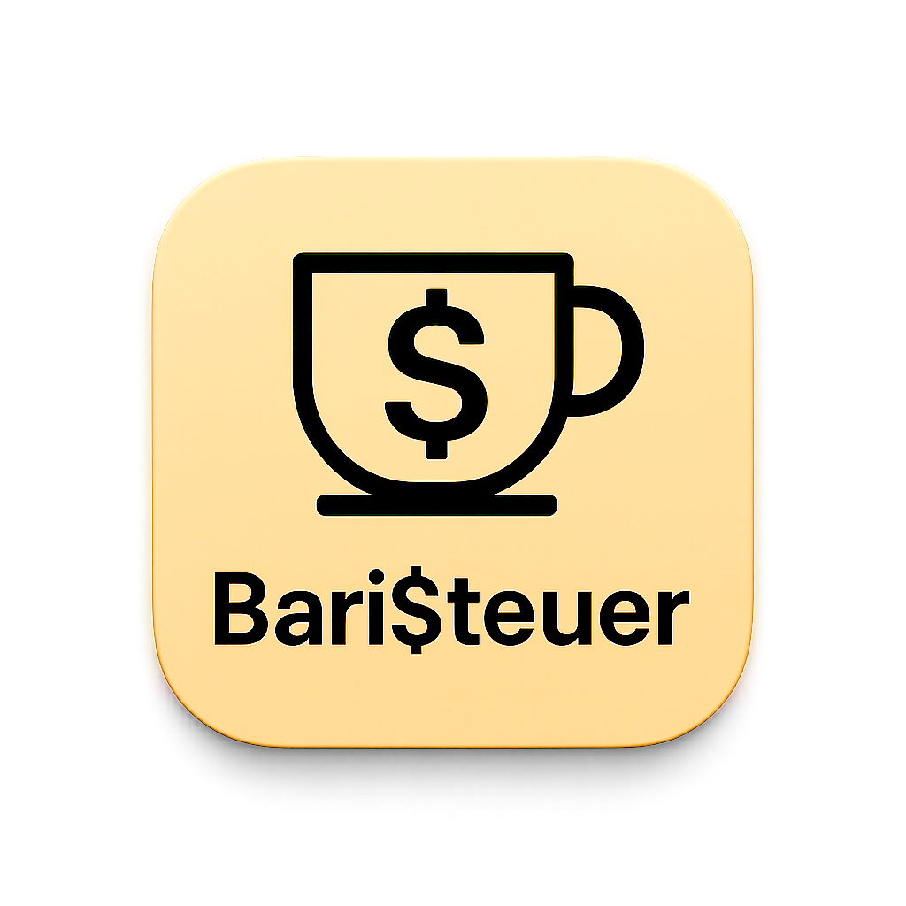

<div align="center">
  
</div>

# Bari$teuer - Tax Management for German Associations

Bari$teuer is a software tool designed to assist German non-profit organizations (Vereine) with their tax management. It provides features for financial data management, tax calculation, and report generation based on German tax regulations for non-profits.

---

## Features

- **Tax Calculation:** Calculates corporate tax (Körperschaftsteuer) and VAT (Umsatzsteuer) for non-profit organizations based on German tax laws.
- **Data Management:** Centralized tracking of income, expenses, and donations.
- **Member Management:** Track club members with join date and contact details.
- **Tax Overview:** Calculates taxes for a project and displays the results in the UI.
- **Reporting:** Generates tax reports for submission.
- **User Interface:** Interface available in German and English with a language selector, styled with Material UI themes.
- **Cross-Platform:** Operates on both macOS and Windows.
- **PDF Export:** Exports financial reports and a set of Vereinssteuerformulare (KSt 1, Anlagen Gem/GK usw.) to PDF format.
- **CSV Export:** Saves incomes and expenses of a project to a CSV file.

## Technology Stack

Bari$teuer is built with the following technologies:

- **Backend:** Go
- **Frontend:** React
- **UI Framework:** Material UI
- **Desktop App Framework:** Wails

## Getting Started

To build Bari$teuer locally, clone the repository and run:

```bash
go work sync
npm install --prefix internal/ui
npm run build --prefix internal/ui
wails build -clean
```

The resulting binaries can be found in `build/bin`. You can configure paths via command-line flags or a `config.json` file. To override settings on the command line use `-db` and `-pdfdir`, e.g.:

```bash
./baristeuer -db mydata.db -pdfdir ./reports
```

To export the current database without starting the UI, call the binary with `-exportdb` and a target path:

```bash
./baristeuer -exportdb backup.db
```

To restore a previously exported database before launching the UI, use `-restoredb`:

```bash
./baristeuer -restoredb backup.db
```

You can export all incomes and expenses of a project to CSV via the service method `ExportProjectCSV` or by using the UI settings panel.

For the first start, copy the provided `config.example.json` to `config.json` and adjust the paths if needed. If `pdfDir` is omitted, reports are written to `./internal/data/reports` by default.

A minimal `config.json` might look like:

```json
{
  "dbPath": "mydata.db",
  "pdfDir": "./reports",
  "logFile": "baristeuer.log",
  "logLevel": "debug"
}
```

Run `./baristeuer -config config.json` to load these settings.

The UI language can be switched between German and English using the dropdown in the top toolbar. You can change the log level at runtime via the service method `SetLogLevel` or by editing the configuration and restarting the application.

Follow the official documentation for platform specific details.

## Testing

1. Run `go work sync`.
2. Execute `go test ./cmd/... ./internal/... ./internal/pdf/...`.
3. Install frontend dependencies with `npm ci --prefix internal/ui`.
4. Run `npm test --prefix internal/ui`.
5. Example: `npm ci --prefix internal/ui && npm test --prefix internal/ui`.

See [docs/DOCUMENTATION.md](docs/DOCUMENTATION.md) for more details.

## Makefile

Common development commands are collected in a small Makefile:

```bash
make vet       # run go vet
make go-test   # run Go tests
make lint      # lint the UI
make ui-test   # run frontend tests
make test      # run Go and UI tests
```

## Packaging

Run the packaging script to build binaries for macOS, Windows and Linux and place them
in versioned directories under `build/bin`:

```bash
./scripts/package.sh
```

The script uses `wails build` internally and names the output directory after the
current Git tag or commit hash.

---

_This project is for internal use and is not open for contributions._
